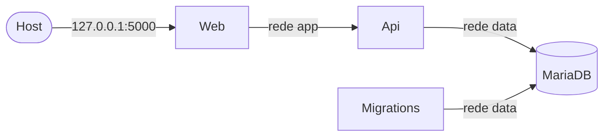

# Executando o Vault com Docker

O `compose.yaml` sobe o banco, as migrations, a Api e o Web. **Apenas o Web é acessível pelo host**
(`http://localhost:5000`); a Api e o banco só existem dentro de redes internas.



## Pré-requisitos

- Docker Engine 25 ou superior e Docker Compose v2 (`docker version --format '{{.Server.Version}}'`).

## Configuração

O compose precisa destas variáveis. Se alguma obrigatória faltar, ele aborta e diz qual.

| Variável | Obrigatória | Quem recebe | Observação |
| :--- | :--- | :--- | :--- |
| `VAULT_DB_ROOT` | Sim | db | Senha do usuário root do MariaDB |
| `VAULT_DB_NAME` | Sim | db, migrations, api | |
| `VAULT_DB_USER` | Sim | db, migrations, api | |
| `VAULT_DB_PASS` | Sim | db, migrations, api | |
| `JWT_SECRET` | Sim | api | Gere com `openssl rand -base64 48` |
| `VAULT_WEB_PORT` | Não (5000) | web | Porta do Web em `127.0.0.1` |
| `DBMAJORVERSION`, `DBMINORVERSION`, `DBBUILDVERSION` | Não (12.3.3) | migrations, api | Versão do MariaDB usada pelo provider do EF |

### De onde vêm os valores

O Docker Compose (o comando `docker compose`, e não os containers nem as aplicações) resolve cada variável nesta ordem:

1. variáveis exportadas no ambiente do shell (por exemplo, no `~/.zshrc`);
2. arquivo `.env` na raiz do repositório (o modelo é o `.env.example`);
3. valor padrão do compose, apenas nas variáveis opcionais.

Use **uma única fonte** para as obrigatórias: se os valores divergirem entre o shell e o `.env`, o shell vence em silêncio.

- **Opção A, ambiente do shell:** exporte as variáveis no `~/.zshrc`. Não é preciso criar `.env`.
- **Opção B, arquivo `.env`:** `cp .env.example .env`, preencha e proteja com `chmod 600 .env`. Isola os valores do restante do ambiente do shell.

Observações:

- O `.zshrc` só vale para shells zsh interativos (o terminal do VS Code serve). Comandos com `sudo` ou processos iniciados fora de um terminal não herdam as variáveis.
- Os containers só recebem as variáveis listadas em `environment:` do `compose.yaml`; o Web, por exemplo, não recebe credenciais de banco nem o `JWT_SECRET`.
- Nem o `dotnet run` nem os containers leem o `.env`; quem o lê é o Compose.
- O `.env` está no `.gitignore` e no `.dockerignore`: não vai para o git nem para as imagens.

Para conferir se as obrigatórias estão definidas, sem exibir os valores (zsh):

```zsh
for v in VAULT_DB_ROOT VAULT_DB_NAME VAULT_DB_USER VAULT_DB_PASS JWT_SECRET; do
  [[ -n "${(P)v}" ]] && echo "$v ok" || echo "$v FALTA"
done
```

## Subir e parar

```bash
docker compose up --build -d   # sobe tudo, na ordem abaixo
docker compose ps -a           # estado dos serviços
docker compose down            # remove os containers e mantém os volumes
docker compose down -v         # CUIDADO: remove também os volumes, inclusive o banco
```

### Ordem de subida

`db` saudável, depois `migrations` concluída com sucesso, depois `api` saudável (`GET /health/ready`) e só então `web`.
Se a migration falhar, a Api e o Web não são iniciados.

## Logs

- Console (JSON, nível Info ou acima): `docker compose logs -f api` (ou `web`). Os logs do próprio framework saem em texto, intercalados.
- Arquivo (JSON, nível Debug): volumes `vault_api-logs` e `vault_web-logs`, montados em `/app/logs`.

## Validação ponta a ponta

Execute a partir de um ambiente limpo (`docker compose down -v`) e com o `vault-local` parado.

1. `docker compose config -q && echo ok`. Para confirmar que um segredo ausente aborta: `env -u JWT_SECRET docker compose config -q` deve falhar com `Defina JWT_SECRET`. Depois, `docker compose up --build -d`.
1. `docker compose ps -a`: `db` e `api` healthy, `migrations` com `Exited (0)`, `web` Up com a única porta `127.0.0.1:5000->8080`.
1. Ordem de subida: `for s in db migrations api web; do echo "$s $(docker inspect -f '{{.State.StartedAt}}' vault-$s-1)"; done` mostra horários crescentes.
1. No navegador: registrar um usuário, fazer login e criar uma Corretora.
1. Isolamento:

```bash
   docker compose exec web bash -c 'exec 3<>/dev/tcp/api/8080 && echo web-alcanca-api'
   docker compose exec web bash -c 'exec 3<>/dev/tcp/db/3306'      # deve falhar
   docker compose exec api bash -c 'exec 3<>/dev/tcp/db/3306 && echo api-alcanca-db'
   docker compose exec api bash -c 'exec 3<>/dev/tcp/1.1.1.1/53'   # deve falhar (sem saída externa)
```

1. Persistência: `docker compose down` e `docker compose up -d`; os dados continuam.
1. Migration com erro barra a Api e o Web:

```bash
   docker compose down && docker compose up -d db
   VAULT_DB_PASS=senha-errada docker compose up -d
   docker compose ps -a    # migrations com código diferente de 0; api e web apenas Created
```

1. Readiness acompanha o banco: `docker compose stop db`; em cerca de 1 minuto a `api` fica `unhealthy`; `docker compose start db` e ela volta a `healthy`.

## Solução de problemas

| Sintoma | Causa e solução |
| :--- | :--- |
| `Defina VAULT_...` ao rodar o compose | Variável obrigatória não definida nem no shell nem no `.env` (ou vazia). Veja "De onde vêm os valores". |
| Migrations falham com acesso negado após trocar a senha | O MariaDB só aplica as variáveis `MARIADB_*` na primeira inicialização do volume. Altere a senha no banco ou, se puder perder os dados, `docker compose down -v`. |
| O navegador do Windows não abre `localhost:5000` | Em `compose.yaml`, remova o prefixo `127.0.0.1:` do mapeamento de portas do Web. |
| Api ou Web não gravam logs em arquivo | Volume criado com dono root antes de o `chown` existir na imagem: `docker volume rm vault_api-logs` (ou `vault_web-logs`) e suba de novo. |
| Voltou para a tela de login após recriar o Web | Esperado: a sessão fica em memória (ver ADR 0005). |

## Decisões de arquitetura

- [0001 Migrations por bundle](adr/0001-migrations-por-bundle.md)
- [0002 Redes segmentadas e exposição apenas do Web](adr/0002-redes-segmentadas-e-exposicao.md)
- [0003 Segredos por variáveis obrigatórias](adr/0003-segredos-por-variaveis-obrigatorias.md)
- [0004 Health checks e ordem de subida](adr/0004-health-checks-e-ordem-de-subida.md)
- [0005 Sessão e chaves do Web não persistidas](adr/0005-sessao-e-chaves-do-web.md)
- [0006 Configuração da Api via builder.Configuration](adr/0006-configuracao-da-api.md)
- [0007 Logs em console e em volume](adr/0007-logs-console-e-volume.md)
